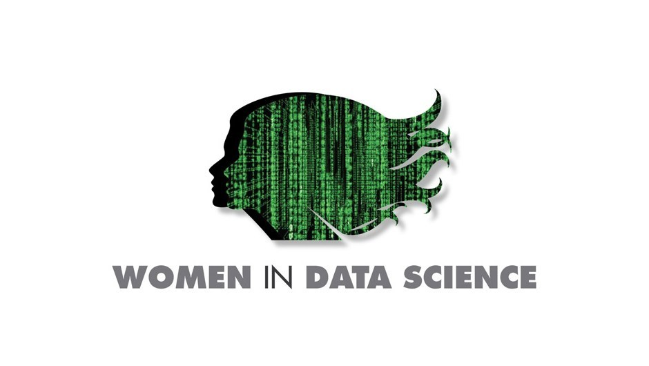

## 
:sparkles: Women in Data Science 2021 Datathon :sparkles:
 

This is the code used to submit entries to the [WiDS 2021 Datathon](https://www.kaggle.com/c/widsdatathon2021). Our team's final ranking was 417 out of 808 with a score of 0.85140. 

### 
**Task**
 
Using data from the first 24 hours of intensive care, create a model to predict diabetes mellitus in an unlabeled dataset. 

### 
 **Files included** 

* README.md - Summary file
* TrainingWiDS2021.csv - 130,157 rows of training data
* UnlabeledWiDS2021.csv - 10,234 rows of unlabeled data
* wids_xgboost_code.ipynb - Jupyter notebook of code
* submission.csv - Final prediction file

### 
 **Necessary packages** 

* Pandas
* NumPy
* sklearn 
* XGBoost